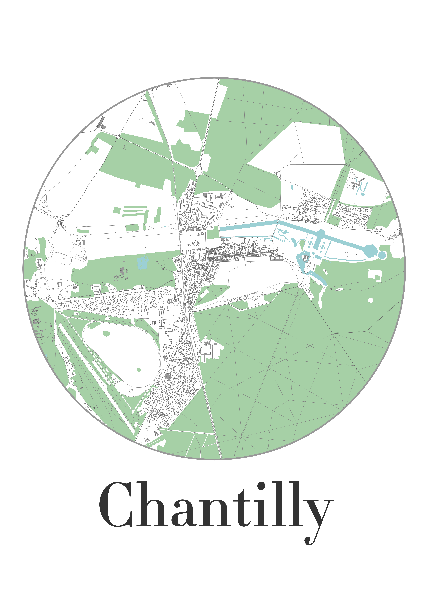

<!-- README.md is generated from README.Rmd. Please edit that file -->

# Create map as a gift

The goal of mapartgift is to help create beautiful maps from
OpenStreetMaps layers for your colleagues and family.

It is deeply inspired (almost forked) from
<https://taraskaduk.com/2019/12/20/print-maps/> and
<https://erdavis.com/2019/07/27/the-beautiful-hidden-logic-of-cities/>

## Installation

You can install the package with

``` r
devtools::install_github("tvroylandt/mapartgift")
```

## Package

The package contains two functions :

  - one to load the data ;
  - one to plot the map.

The fist step is to download the shapefiles into
maps/shapefiles/region\_name which can be done with the following chunk
:

``` r
# url <- "http://download.geofabrik.de/europe/france/picardie-latest-free.shp.zip"
# curl::curl_download(url, destfile = "picardie.shp.zip")
# unzip("picardie.shp.zip", exdir = "inst/shapefiles/picardie")
```

After that you can make some maps. Just be careful with the CRS.

``` r
library(mapartgift)
library(magick)
#> Linking to ImageMagick 6.9.7.4
#> Enabled features: fontconfig, freetype, fftw, lcms, pango, x11
#> Disabled features: cairo, ghostscript, rsvg, webp
library(tidyverse)
#> ── Attaching packages ───────────────────────────────────────────────────────────────────────────── tidyverse 1.2.1 ──
#> ✓ ggplot2 3.2.1     ✓ purrr   0.3.3
#> ✓ tibble  2.1.3     ✓ dplyr   0.8.3
#> ✓ tidyr   1.0.0     ✓ stringr 1.4.0
#> ✓ readr   1.3.1     ✓ forcats 0.4.0
#> ── Conflicts ──────────────────────────────────────────────────────────────────────────────── tidyverse_conflicts() ──
#> x dplyr::filter() masks stats::filter()
#> x dplyr::lag()    masks stats::lag()
```

## Family

``` r
# Chantilly
map_art_gift_load(
  region = "picardie",
  name_place = "Chantilly",
  crs = 2154,
  dist_shape = 3,
  building = TRUE
)
map_art_gift_plot(
  region = "picardie",
  name_place = "Chantilly",
  building = TRUE,
  building_shp = building_cropped
)

# Saint-Rimault
map_art_gift_load(
  region = "picardie",
  name_place = "Saint-Rimault",
  crs = 2154,
  dist_shape = 2,
  building = TRUE
)
map_art_gift_plot(
  region = "picardie",
  name_place = "Saint-Rimault",
  building = TRUE,
  building_shp = building_cropped
)

# Lille
map_art_gift_load(
  region = "nord-pas-de-calais",
  name_place = "Lille",
  crs = 2154,
  dist_shape = 4
)
map_art_gift_plot(region = "nord-pas-de-calais", name_place = "Lille")

# Paris
map_art_gift_load(
  region = "ile-de-france",
  name_place = "Paris",
  crs = 2154,
  dist_shape = 7
)
map_art_gift_plot(region = "ile-de-france", name_place = "Paris")

# Evanston
map_art_gift_load(
  region = "illinois",
  name_place = "Evanston",
  crs = 3528,
  dist_shape = 5
)
map_art_gift_plot(region = "illinois", name_place = "Evanston")

# Bruxelles
map_art_gift_load(
  region = "belgium",
  name_place = "Bruxelles",
  crs = 3812,
  dist_shape = 5
)
map_art_gift_plot(region = "belgium", name_place = "Bruxelles")

# Laigneville
map_art_gift_load(
  region = "picardie",
  name_place = "Laigneville",
  crs = 2154,
  dist_shape = 2,
  building = TRUE
)
map_art_gift_plot(
  region = "picardie",
  name_place = "Laigneville",
  building = TRUE,
  building_shp = building_cropped
)

# Pontpoint
map_art_gift_load(
  region = "picardie",
  name_place = "Pontpoint",
  crs = 2154,
  dist_shape = 4,
  building = TRUE
)
map_art_gift_plot(
  region = "picardie",
  name_place = "Pontpoint",
  building = TRUE,
  building_shp = building_cropped
)

# Verneuil-en-Halatte
map_art_gift_load(
  region = "picardie",
  name_place = "Verneuil",
  crs = 2154,
  dist_shape = 1.5,
  building = TRUE
)
map_art_gift_plot(
  region = "picardie",
  name_place = "Verneuil",
  building = TRUE,
  building_shp = building_cropped
)
```



## Assemble the maps

``` r
# Maman
map_chantilly <- image_read("maps/output/picardie_Chantilly_297_420.png")
map_lille <- image_read("maps/output/nord-pas-de-calais_Lille_297_420.png")
map_evanston <- image_read("maps/output/illinois_Evanston_297_420.png")
map_bruxelles <- image_read("maps/output/belgium_Bruxelles_297_420.png")

map_assemble1 <- image_append(image = c(map_evanston, map_chantilly))
map_assemble2 <- image_append(image = c(map_bruxelles, map_lille)) 

map_assemble_maman <- image_append(image = c(map_assemble1, map_assemble2), stack = TRUE)

image_write(map_assemble_maman, "maps/output/assemble_maman.png")

# Christine
map_chantilly <- image_read("maps/output/picardie_Chantilly_297_420.png")
map_verneuil <- image_read("maps/output/picardie_Verneuil_297_420.png")
map_laigneville <- image_read("maps/output/picardie_Laigneville_297_420.png")
map_pontpoint <- image_read("maps/output/picardie_Pontpoint_297_420.png")

map_assemble3 <- image_append(image = c(map_verneuil, map_pontpoint))
map_assemble4 <- image_append(image = c(map_laigneville, map_chantilly)) 
map_assemble_kiki <- image_append(image = c(map_assemble3, map_assemble4), stack = TRUE)

image_write(map_assemble_kiki, "maps/output/assemble_kiki.png")

# Celine
map_assemble_celine <- image_append(image = c(map_verneuil, map_laigneville)) 
image_write(map_assemble_celine, "maps/output/assemble_celine.png")
```


